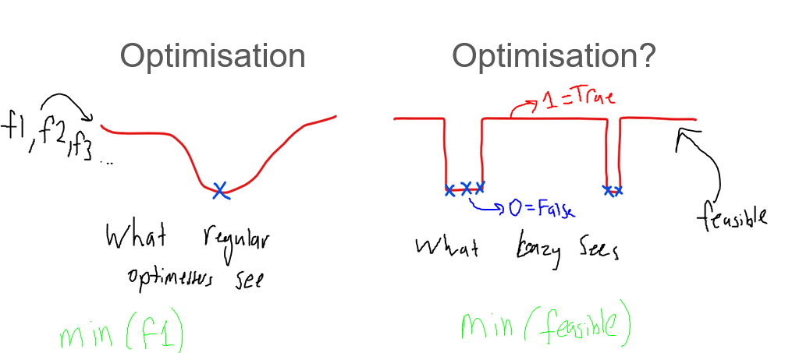

# How to define 'solver_function'

In lazy_opt, the user is able to pass any function into the optimiser for the optimiser to work with. 

    lazy = LazyOpt(solver_function=function_call,
                   bounds=bounds,
                   hyper_params=hyper_params,
                   seed=None,
                   options=options
                   )

solver_function, must have the following input and output:

## Input `[x1,x2,x3...]`
genrally, the design space vector (x) is stored like this:
```
# A 2D array, colomns are variables
[[x1,x2,x3...],
 [x1,x2,x3]...]
```
however, solver_function will always be given something like this:`[x1,x2,x3...]`, so it does not have to support 2d inputs

## Output `feasible, (f0,f1,f2...)`

The feasbile records if a design has met the design requirements (is feasible), and the objectives are stored in a tuple

```python
    # simplest possible solver_function:
    def solver_function:
        feasible = True
        f1 = 0
        return feasible, (f1,)
    # this function is saying, that all designs are infeasible!
```

It is really confusing, but feasible=False, means that the design is actully feasible!

If you make the mistake and flip the feasible boolean, it will force the algorithim to seek infeasible designs, and break everything.

Let me explain why it is defined like that:

Mathematically, regular optimisation problems minimise the objective
functions (f1,f2,f3...).

However, lazy treats 'feasible' as the objective function, and 'feasible'
can either be 0 (false) or 1 (true). And since 0 is less than 1, the minimisation
always seeks 0.


So, you usually have to flip your feasible boolean.

#### Feasible=False=0 <- this design is feasible!!!
#### Feasible=True=1 <- the design is infeasible!!!
